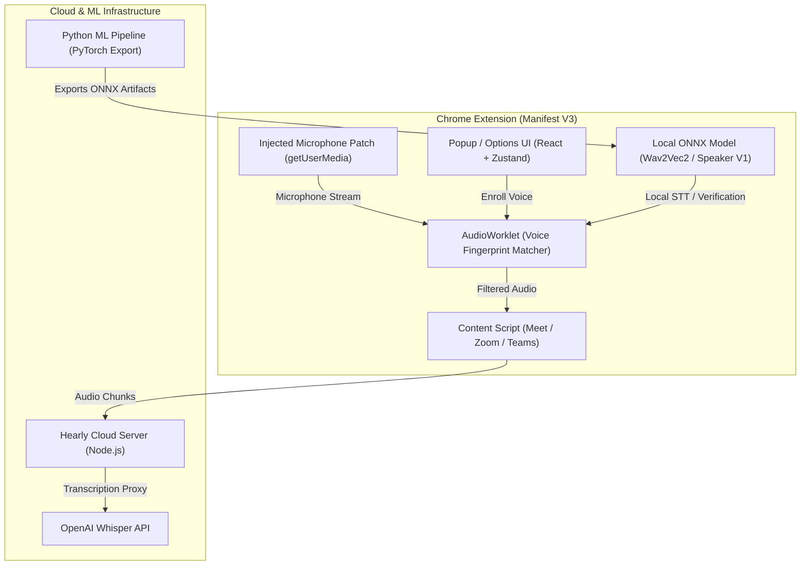

# 🎙️ Hearly — AI Voice Isolation & Meeting Transcription

<p align="center">
  <b>Isolate your voice. Filter out background noise & other speakers. Transcribe meetings in real-time.</b>
</p>

<p align="center">
  
  
  
  
  
</p>

---

## 🌟 Overview

**Hearly** is an AI-powered voice isolation and real-time meeting assistant. It learns your unique voice signature through a brief enrollment process and uses a custom WebAudio AudioWorklet + ONNX neural speaker verification pipeline to dynamically isolate your voice while suppressing background noise, room echo, and other people speaking during calls.

Whether you're in **Google Meet**, **Zoom**, or **Microsoft Teams**, Hearly patches your microphone stream in real time and provides live offline/cloud meeting transcription with encrypted local history storage.

---

## ✨ Key Features

- **🎙️ AI Voice Enrollment & Isolation**: Enrolls your voice profile (192-dimensional embedding vector) in under 30 seconds and ducks non-matching voice frequencies dynamically.
- **🌐 Cross-Platform Meeting Support**: Seamless integration into Google Meet, Zoom, and Microsoft Teams via lightweight content scripts.
- **⚡ Real-Time WebAudio Processing**: Operates entirely in a low-latency AudioWorklet thread inside the browser without audio lag.
- **📝 Live Transcription & Overlay**: Real-time speech-to-text with floating subtitle overlays and local AES-GCM encrypted history.
- **🤖 Offline & Cloud AI Inference**:
  - **Local**: ONNX Runtime (Wav2Vec2 / custom speaker model) directly in WebAssembly.
  - **Cloud Proxy**: Fast fallback to OpenAI Whisper & LLM assistant endpoints.
- **💻 Sleek Web Landing Page**: High-performance showcase UI built with React + Vite + TailwindCSS.
- **🧠 Python ML Model Suite**: PyTorch training scripts for custom speaker verification models and ONNX model exporters.

---

## 📂 Repository Structure

```
Hearly/
├── hearly-extension/      # 🧩 Manifest V3 Chrome Extension (React + TS + AudioWorklet)
├── hearly-web/            # 🌐 High-performance marketing web app & landing page
├── hearly-cloud-server/   # ☁️ Node.js proxy server for Whisper & AI completions
├── hearly-model/          # 🧠 PyTorch speaker verification training & ONNX export suite
├── docs/                  # 📄 Architectural specs, launch checklists & privacy policies
├── PROJECT_FILE_ANALYSIS.md
├── UI_CONTEXT.md
└── package.json           # Root workspace configuration
```

---

## 🏗️ System Architecture



---

## 🚀 Getting Started

### Prerequisites

- **Node.js**: `v18.x` or higher
- **npm**: `v9.x` or higher
- **Python**: `3.10+` (optional, only for model training)

---

### 1. 🧩 Chrome Extension (`hearly-extension`)

Build the extension to load it into Chrome:

```bash
# Navigate to extension directory
cd hearly-extension

# Install dependencies
npm install

# Build extension (output in ./dist)
npm run build
```

**To Load in Chrome:**
1. Open `chrome://extensions/` in Google Chrome.
2. Enable **Developer mode** in the top-right corner.
3. Click **Load unpacked** and select the `hearly-extension/dist` folder.

---

### 2. 🌐 Web Application (`hearly-web`)

Run the marketing landing page locally:

```bash
# Navigate to web directory
cd hearly-web

# Install dependencies
npm install

# Start development server
npm run dev
```

Open [http://localhost:5173](http://localhost:5173) in your browser.

---

### 3. ☁️ Cloud Proxy Server (`hearly-cloud-server`)

The proxy server provides cloud transcription via OpenAI Whisper and AI meeting summaries:

```bash
cd hearly-cloud-server

# Install dependencies
npm install

# Create environment file
cp .env.example .env
# Edit .env and set your OPENAI_API_KEY

# Start server
node server.mjs
```

Default server URL: `http://localhost:3001`

---

### 4. 🧠 Speaker Model Suite (`hearly-model`)

To train or export custom ONNX speaker embedding models:

```bash
cd hearly-model

# Create virtual environment
python3 -m venv .venv
source .venv/bin/activate

# Install requirements
pip install -r requirements.txt

# Run model setup and export script
python setup_dev_models.py
```

---

## 🔒 Security & Privacy

- **On-Device Voice Isolation**: Speaker matching and voice ducking execute locally inside your browser via WebAudio AudioWorklet.
- **Local Storage Encryption**: Meeting transcripts and user settings are stored in Chrome local storage using AES-GCM encryption.
- **Privacy Policy**: Detailed privacy compliance documentation is located in [`docs/PRIVACY.md`](file:///Users/rehan/Desktop/Hearly/docs/PRIVACY.md).

---

## 🛠️ Tech Stack Summary

| Layer | Technology |
|---|---|
| **Extension Framework** | Chrome Extension Manifest V3, React 18, TypeScript, Vite, CRXJS |
| **Styling** | TailwindCSS, Lucide Icons, Framer Motion |
| **Audio Processing** | Web Audio API, AudioWorklet, Custom 192D Embedding Matcher |
| **Offline AI Inference** | ONNX Runtime Web (`onnxruntime-web`), WebAssembly (WASM) |
| **State & Storage** | Zustand, Chrome Storage API, Web Crypto API (AES-GCM) |
| **Backend & Cloud** | Node.js (ESM), Express/HTTP, OpenAI Whisper API |
| **ML & Training** | Python 3.10+, PyTorch, Librosa, ONNX Export Tools |

---

## 📄 License

This repository is maintained by **Rehan**. All rights reserved.
